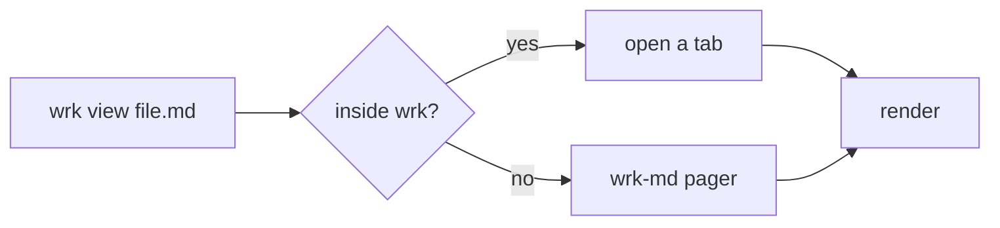
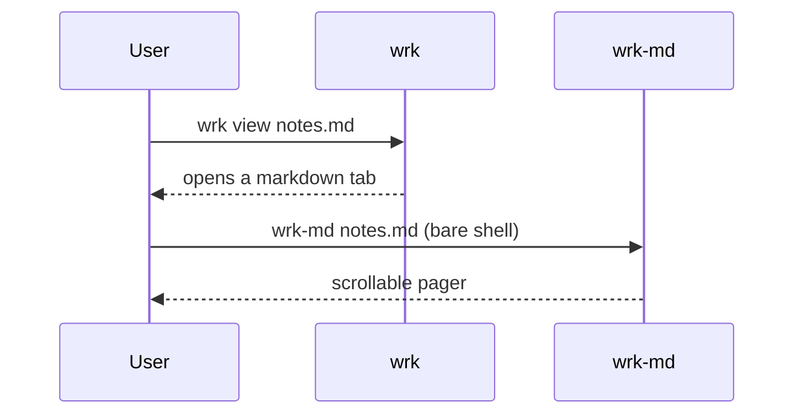

# wrk-markdown showcase

A single document exercising everything the `wrk-markdown` renderer can do —
open it with **`wrk view demo/showcase.md`** (a tab inside wrk) or **`wrk-md
demo/showcase.md`** (standalone pager) on a graphics-capable terminal.

> This paragraph is a block quote. It shows the gutter and quote color, and it
> wraps to the width of the pane just like ordinary prose does.

---

## Text & inline styles

Regular text with **bold**, *italic*, ***bold italic***, ~~strikethrough~~, and
`inline code`. Links keep their text and are styled, like
[the wrk repo](https://github.com/kinyoklion/wrk). A footnote reference sits
here.[^1]

[^1]: Footnotes render their marker inline and are collected as text.

## Headings render at true sizes

### This H3 is smaller than the H2 above it

Headings `H1`–`H3` rasterize as real, larger type; `H4`–`H6` stay as styled
text:

#### H4 stays text

##### H5 stays text

## Lists

Unordered, with nesting:

- Panes: Claude session, shell, and markdown tabs
  - Markdown tabs are ephemeral
  - Claude tabs persist to `projects.toml`
- Status dots: waiting / busy / notification

Ordered:

1. Detect the terminal graphics protocol
2. Rasterize images and diagrams
3. Draw with kitty / sixel / iterm2, or half-block fallback

Task list:

- [x] Inline images (incl. SVG)
- [x] Mermaid diagrams
- [x] True-size headings
- [ ] Configurable code-block panels

## Table

Column alignment and zebra-striped rows:

| Capability     | Feature     | Renders as            |
| :------------- | :---------: | --------------------: |
| Syntax code    | `highlight` | colored text          |
| Inline images  | `images`    | terminal graphics     |
| Mermaid        | `mermaid`   | SVG → image           |
| Headings H1–H3 | `images`    | SVG → image           |

## Code blocks

Syntax-highlighted by language:

```rust
/// Count word frequencies in `text`.
fn word_counts(text: &str) -> std::collections::HashMap<&str, u32> {
    let mut counts = std::collections::HashMap::new();
    for word in text.split_whitespace() {
        *counts.entry(word).or_insert(0) += 1;
    }
    counts
}
```

```python
def fib(n: int) -> int:
    a, b = 0, 1
    for _ in range(n):
        a, b = b, a + b
    return a  # nth Fibonacci number
```

An untagged block falls back to plain, unhighlighted text:

```
wrk add ~/projects/foo --name foo
wrk view ./notes.md
```

## Mermaid diagrams

A flowchart:



A sequence diagram:



## Images

Raster images (`png`/`jpeg`/`gif`/`webp`) decode and display inline. Here is
Ferris, the Rust mascot:


Relative links resolve against this file's directory; remote (`http(s)://`) and
`data:` links stay as `🖼` placeholders.

---

*Image credit: Ferris by Karen Rustad Tölva, released into the public domain
(CC0) via [rustacean.net](https://rustacean.net/).*
